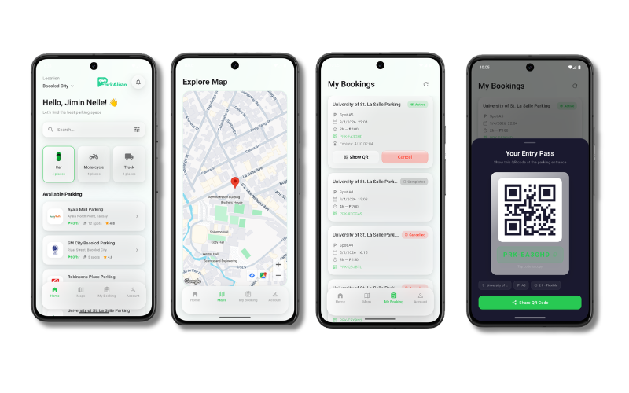
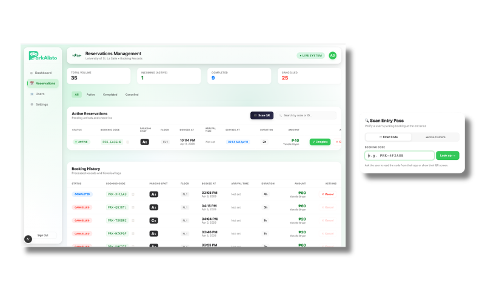
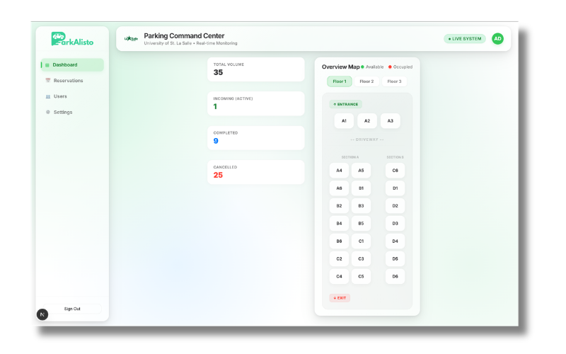

<div align="center">
  
  <h1 align="center">ParkAlisto Mobile</h1>
  <p align="center">
    <strong>A Modern, Liquid Glass Smart Parking Reservation & Management System</strong>
  </p>

  <p align="center">
    
    
    
    
    
  </p>

  <p align="center">
    <a href="#-key-features">Features</a> •
    <a href="#-showcase">Showcase</a> •
    <a href="#-tech-stack">Tech Stack</a> •
    <a href="#-getting-started">Getting Started</a>
  </p>
</div>

---

## 💡 Project Overview

**ParkAlisto** is an end-to-end smart parking platform designed to streamline the reservation, management, and verification of parking spaces in real-time. Built with an Apple-inspired **Liquid Glass UI** design system, it bridges the gap between drivers seeking seamless parking and administrators requiring complete operational visibility. 

The ecosystem consists of two primary modules:
1. **ParkAlisto Mobile Client**: A stunning cross-platform Flutter app for user bookings, spot selection, and navigation.
2. **ParkAlisto Admin Dashboard**: A robust, responsive Next.js web portal for parking administrators to track real-time occupancy, manage walk-in reservations, and scan entry/exit tickets.

---

## 🖼️ Showcase

### 📱 Modern Mobile Experience
Explore the stunning frosted-glass aesthetic and intuitive workflow crafted for drivers on the go.

<div align="center">
  
</div>

<br />

### 🖥️ Robust Administration
Manage and monitor parking zones with advanced real-time reservation lists and automated scanning tools.

<div align="center">
  
  <br/><br/>
  
</div>

---

## ✨ Key Features

### 📱 Mobile App (Flutter & Supabase)
*   **🎯 Smart Parking Search**: Browse and discover nearby parking locations with instantly updated spot availability.
*   **🗺️ Interactive Live Map**: Visualize nearby parking zones on a fully integrated, fluid map interface.
*   **🪟 Visual Spot Selection**: A clean, interactive parking grid allows users to select and secure their preferred spots with absolute precision.
*   **🎟️ Real-Time Booking**: Hassle-free reservation workflows supported by instant verification tickets.
*   **🌊 Liquid Glass UI**: A visually rich experience leveraging smooth mesh gradients, frosted glass containers, and subtle micro-animations.
*   **👤 Secure Account Management**: Effortlessly manage personal user profiles, ride details, and booking history.

### 🖥️ Admin Web Portal (Next.js & Tailwind)
*   **📊 Real-Time Analytics**: Monitor current occupancy rates, peak usage times, and location health from a comprehensive dashboard.
*   **📝 Reservation Lifecycle Control**: Review, search, and manually modify customer reservations instantly.
*   **📥 Walk-In Entry Management**: Facilitate seamless entry for vehicles without prior online reservations directly on-site.
*   **🔍 Entrance & Exit Scanners**: Built-in scanning mechanisms to audit QR codes for secure validations at gates.
*   **⚙️ Dynamic Configurations**: Configure operating hours, pricing algorithms, and capacity per zone dynamically.

---

## 🎨 Apple Liquid Glass Design System

ParkAlisto delivers a premium user experience prioritizing aesthetics and physics-based interactions:

*   **✨ Translucency & Blur**: Deep backdrop-filter blur overlays create content depth and hierarchy.
*   **🌈 Dynamic Mesh Gradients**: Smoothly shifting colorful nodes animate the background subtly, maintaining freshness.
*   **🌿 Curated Color Palette**: Soft greys, light neutrals, and a refined Brand Green (`#2E7D32`) for semantic visual triggers.
*   **✍️ Premium Typography**: Handcrafted type scaling using Google Fonts' **Outfit** family for ultra-crisp readability.

---

## 🛠️ Tech Stack

### 🏗️ Client Architecture
*   **Core Framework**: Flutter (Dart SDK)
*   **State Management**: Provider
*   **Database Integration**: Supabase Real-Time
*   **UI Components**: Custom Glassmorphic Widgets & Cupertino Icons

### 🌐 Web & Backend Architecture
*   **Web Framework**: Next.js (App Router)
*   **Language**: TypeScript
*   **Styling**: TailwindCSS
*   **Persistence**: PostgreSQL via Supabase Backend

---

## 📂 Repository Structure

```text
ParkAlisto-Mobile/
├── admin_dashboard/             # 🖥️ Next.js Administrative Web Portal
│   ├── src/app/
│   │   ├── reservations/        # Reservation manager
│   │   ├── scanner/             # Live code scanner page
│   │   ├── exit-scanner/        # Check-out auditor page
│   │   └── walk-in/             # On-site booking UI
├── lib/                         # 📱 Flutter Mobile Application
│   ├── screens/
│   │   ├── home_screen.dart     # Dashboard & search
│   │   ├── choose_spot_screen.dart # Interactive grid
│   │   └── map_screen.dart      # Integrated map view
│   ├── services/
│   │   └── app_state.dart       # Global reactive state
│   └── widgets/                 
│       ├── glass_container.dart # Liquid Glass reusable card
│       └── dynamic_mesh_background.dart # Custom-painter animated background
├── assets/
│   ├── readme/                  # Repository documentation assets
│   └── icons/                   # Production app brand iconography
```

---

## 🚀 Getting Started

Follow the guides below to run each component of the ParkAlisto ecosystem.

### 📱 Setting Up the Flutter Mobile App

#### Prerequisites
*   [Flutter SDK](https://docs.flutter.dev/get-started/install) (Tested on ^3.10.7)
*   Android Studio / Xcode (For device emulation)

#### Steps
```bash
# 1. Navigate into root folder
cd ParkAlisto-Mobile

# 2. Fetch Flutter Dependencies
flutter pub get

# 3. Run on Emulator / Physical Device
flutter run
```

### 🖥️ Setting Up the Admin Dashboard

#### Prerequisites
*   [Node.js](https://nodejs.org/) (v18+ Recommended)
*   npm / yarn / pnpm

#### Steps
```bash
# 1. Navigate to the Dashboard subfolder
cd admin_dashboard

# 2. Install Node Dependencies
npm install

# 3. Run Local Development Server
npm run dev
```
Once started, open **[http://localhost:3000](http://localhost:3000)** to explore the live portal.

---

## 🔑 Environment Setup

Both applications depend on an active Supabase project. Ensure you have executed the migration scripts located in the repository root (`supabase_migrations.sql`, `enable_realtime.sql`) into your Supabase SQL editor to bootstrap the necessary PostgreSQL tables, foreign keys, and real-time publication configurations.

---

<div align="center">
  <p>Developed with 💚 by <strong><a href="https://github.com/yanellebryan">Yanelle Bryan</a></strong></p>
</div>
